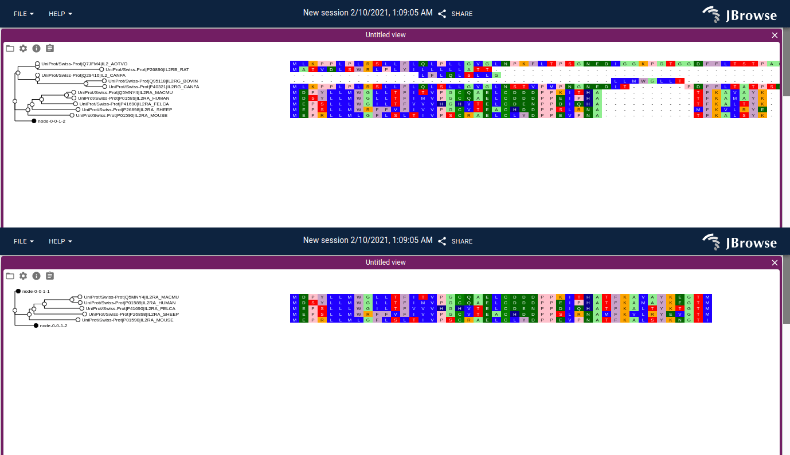
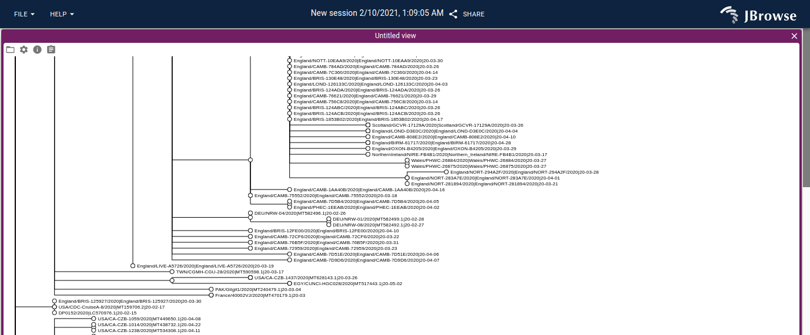

# jbrowse-plugin-msaview

## Gallery

## Demo

https://s3.amazonaws.com/jbrowse.org/code/jb2/master/index.html?config=https://unpkg.com/jbrowse-plugin-msaview/dist/config.json&session=share-BVmmEYAoAv&password=SuQaN

## Features

- Vertical virtualized scrolling of phylogenetic tree
- Vertical and horizontal virtualized scrolling of multiple sequence alignment
- View metadata about alignment from MSA headers (e.g. stockholm)
- Collapse subtrees with click action on branches which also hides gaps that
  were introduced by that subtree in the rest of the alignment
- Allows "zooming out" by setting tiny rowHeight/colWidth settings
- Allows changing color schemes, with jalview, clustal, and other color schemes
- Allows toggling the branch length rendering for the phylogenetic tree
- Can share sessions with other users which will send relevant settings and
  links to files to automatically open your results
- The tree or the MSA panel can be loaded separately from each other

## File format supports

- FASTA formatted for MSA (e.g. gaps already inserted)
- Stockholm files (e.g. .stock file, with or without embedded newick tree, uses
  stockholm-js parser. also supports "multi-stockholm" files with multiple
  alignments embedded in a single file)
- Clustal files (e.g. .aln file, uses clustal-js parser)
- Newick (tree can be loaded separately as a .nh file)
