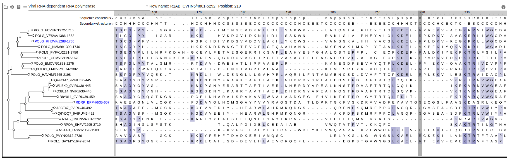
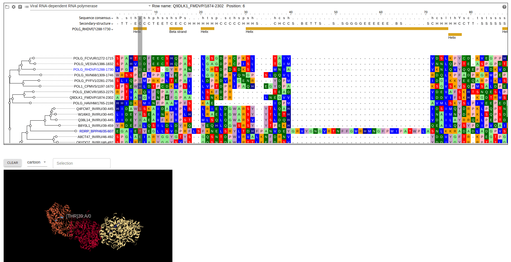

# react-msaview

## Demo

See https://gmod.github.io/react-msaview

This page is a deployment of the `app` directory in this repo, which uses the
`react-msaview` NPM package as a minimal example app

## Screenshot





## Docs

See [user guide](docs/user_guide.md)

## Developers

To begin run git clone the repo and run `yarn && yarn start`

This will actually in parallel start the code in the lib directory (containing
the npm package named react-msaview) and the app directory (containing a
create-react-app demo app)

## Using react-msaview in an external app

Install react-msaview. Your app should have @jbrowse/core, @material-ui/core,
react, react-dom since react-msaview uses these as peerDependencies

\$ yarn add react-msaview

Example script

```js
import { observer } from 'mobx-react'
import { MSAView, MSAModel } from 'msaview'
import { createJBrowseTheme } from '@jbrowse/core/ui/theme'
import { ThemeProvider } from '@material-ui/core/styles'

function App() {
  const theme = createJBrowseTheme()

  const model = MSAModel.create({ id: `${Math.random()}`, type: 'MsaView' })
  // can pass msaFilehandle and treeFilehandle if you want to point at a URL of a MSA/tree
  // const model = MSAModel.create({ id: `${Math.random()}`, type: "MsaView", msaFilehandle: {uri:'http://path/to/msa.stock'} });
  // or pass a string of an msa/tree directly to the "data" field if not pointing to a URL
  // const model = MSAModel.create({ id: `${Math.random()}`, type: "MsaView", data: {msa:/*string of msa here */} });

  // choose MSA width, calculate width of div/rendering area if needed beforehand
  model.setWidth(1800)

  return (
    <ThemeProvider theme={theme}>
      <div style={{ border: '1px solid black', margin: 20 }}>
        <MSAView model={model} />
      </div>
    </ThemeProvider>
  )
}
```

## Using react-msaview in a plain HTML file with UMD bundle

```html
<html>
  <head>
    <script>
      window.global = window
    </script>
    <script
      crossorigin
      src="https://unpkg.com/react@17/umd/react.development.js"
    ></script>
    <script
      crossorigin
      src="https://unpkg.com/react-dom@17/umd/react-dom.development.js"
    ></script>
    <script
      crossorigin
      src="https://unpkg.com/react-msaview@1.3.1/bundle/index.js"
    ></script>
  </head>
  <body>
    <div id="root" />
    <script>
      const { MSAView, MSAModel } = window.ReactMSAView
      const model = MSAModel.create({ id: `${Math.random()}`, type: 'MsaView' })
      // can pass msaFilehandle and treeFilehandle if you want to point at a URL of a MSA/tree
      // const model = MSAModel.create({ id: `${Math.random()}`, type: "MsaView", msaFilehandle: {uri:'http://path/to/msa.stock'} });
      // or pass a string of an msa/tree directly to the "data" field if not pointing to a URL
      // const model = MSAModel.create({ id: `${Math.random()}`, type: "MsaView", data: {msa:/*string of msa here */} });

      // choose MSA width, calculate width of div/rendering area if needed beforehand
      model.setWidth(1800)

      ReactDOM.render(
        React.createElement(MSAView, { model }),
        document.getElementById('root'),
      )
    </script>
  </body>
</html>
```

## API

The following fields can be passed as fields to the MSAModel.create function

```js
const MSAModel = types.model('MsaView', {
  // internal
  id: ElementId,
  // internal
  type: types.literal('MsaView'),

  // height of msaview
  height: types.optional(types.number, 550),

  // space to give to treeArea
  treeAreaWidth: types.optional(types.number, 400),

  // width of tree within treeArea, can be wider than treeAreaWidth
  treeWidth: types.optional(types.number, 300),

  // height of a row, at <10 it doesn't draw the text
  rowHeight: 20,

  // scroll position Y
  scrollY: 0,

  // scroll position X
  scrollX: 0,

  // width of the horizontal resize handle
  resizeHandleWidth: 5,

  // internal, could be adjusted for performance
  blockSize: 1000,

  // internal, current hovered mouse row
  mouseRow: types.maybe(types.number),

  // internal, current hovered mouse col
  mouseCol: types.maybe(types.number),

  // internal, but can be observed: user selects that they want to view a
  // structure. used by https://gmod.github.io/react-msaview/ demo app to
  // display 3d structures
  selectedStructures: types.array(StructureModel),

  // choose to align labels on right
  labelsAlignRight: false,

  // width of a column, can be small for "zoom out"
  colWidth: 16,

  // use the phylogenetic branch length for tree drawing
  showBranchLen: true,

  // draw the color in the background. if false, letters of MSA are colored instead
  bgColor: true,

  // whether to draw tree or not
  drawTree: true,

  // draw node bubbles at tree tips
  drawNodeBubbles: true,

  // high resolution scaling of canvas, can be increased for super high def
  highResScaleFactor: 2,

  // default color scheme, see  lib/src/colorSchemes.ts for more
  colorSchemeName: 'maeditor',

  // pass a default tree filehandle, e.g. formatted as {uri:'http://path/to/your/file.nh'}
  treeFilehandle: types.maybe(FileLocation),

  // pass a default msa filehandle, e.g. formatted as
  // {uri:'http://path/to/your/file.stock'}, stock can contain a tree and you
  // don't have to pass treeFilehandle if msa contains a tree e.g. for stockholm
  msaFilehandle: types.maybe(FileLocation),

  // if the msa contains multiple alignments e.g. for multi-stockholm, which
  // one to display
  currentAlignment: 0,

  // array of nodes to collapse
  collapsed: types.array(types.string),

  // array of nodes to focus on
  showOnly: types.maybe(types.string),

  // alternative to msaFilehandle/treeFilehandle: if you have an MSA or tree as
  // a string, you can pass this directly to the "data" field. note: you can
  // supply just the tree, just the msa, or both
  data: types.optional(
    types
      .model({
        tree: types.maybe(types.string),
        msa: types.maybe(types.string),
      })
      .actions(self => ({
        setTree(tree?: string) {
          self.tree = tree
        },
        setMSA(msa?: string) {
          self.msa = msa
        },
      })),
    { tree: '', msa: '' },
  ),
})
```

## Notes

This repo also supports https://github.com/GMOD/jbrowse-plugin-msaview which is
a jbrowse 2 plugin for viewing MSAs

This repo also builds on abrowse (https://github.com/ihh/abrowse) and
phylo-react (https://www.npmjs.com/package/phylo-react)
