# react-msaview

We developed the react-msaview to make a compact, efficient, and scalable
web-based MSA viewer. Being web-based, it is easily shareable with other users.
We take special care to make the code efficient by rendering to HTML5 canvas and
to use tiled scrolling.

## Features

### Scalability

- 1D vertical tiled scrolling of phylogenetic tree to optimize rendering of
  large trees

- 2D tiled scrolling to optimize rendering of large multiple sequence alignments

- Examples: can render 230k node newick tree from UCSC COVID-19 sample tree

### View detailed metadata about entries inside the app

- E.g. View metadata about alignment from MSA datafile headers (e.g. stockholm)

- E.g. View metadata about "annotation tracks" from UniProt in a dialog e.g. GFF
  file

### Shareability

- Can share sessions with other users by copying and pasting the URL which will
  send all relevant settings about what is in a session to other users to open
  your results

### Data exploration

- Collapse certain subtrees with click action on branches which also hides gaps
  that were introduced by that subtree in the rest of the alignment

- View only subtree to only view a small section of a large MSA

### Customizability

- Allows changing color schemes, with jalview, clustal, and other color schemes

- Allows toggling the branch length rendering for the phylogenetic tree

- The tree or the MSA panel can be loaded separately from each other

- Can draw labels aligned right or next to the tree

- Allows "zooming out" by setting tiny rowHeight/colWidth settings to get big
  picture patterns in MSA data

### Protein domain/structure tracks

- Users can dynamically fetch data from UniProt to plot protein domains (for a
  specific protein) on the MSA (specific protein's coordinates translated to
  account for gaps in MSA coordinate space)

### 3D protein structure viewer

- Users can launch a 3D structure viewer of a particular protein in the MSA,
  which launches an NGL protein visualizer
  ([https://nglviewer.github.io/](https://nglviewer.github.io/)) on the page

- Hovering over the various columns in the MSA highlights the position on the
  protein and vice-versa

### User-generated annotations

- Users can click and drag over a particular region and create an annotation

- The user can then export this data in GFF3 format using the "Get info" on the
  User-created annotations track

- User annotations can be shared via simple copy and paste of the URL with
  others

### Reusability and availability

- The code is published on NPM as the `react-msaview` package

- A simple instantiation of our component is also available at this weblink
  [https://gmod.github.io/react-msaview/](https://gmod.github.io/react-msaview/)

### File format support

- FASTA formatted for MSA (e.g. gaps already inserted)

- Stockholm files (e.g. .stock file, with or without embedded newick tree, uses
  stockholm-js parser. also supports "multi-stockholm" files with multiple
  alignments embedded in a single file)

- Clustal files (e.g. .aln file, uses clustal-js parser)

- Newick (tree can be loaded separately as a .nh file)

### Embedding in JBrowse 2

- We have also released the code as a JBrowse 2 plugin, where the MSA can be
  displayed alongside other JBrowse 2 genome browser panels

- Available here
  [https://github.com/GMOD/jbrowse-plugin-msaview](https://github.com/GMOD/jbrowse-plugin-msaview)

- We expect to make features to make a workflow to go from genome-\>gene
  annotation-\>MSA-\>protein viewer

## Screenshots

### Import form

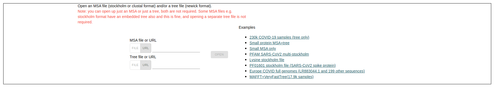

The "import form" with pre-loaded examples including a 230K node COVID tree from
UCSC, several CLUSTAL formatted files, several RNA and Protein formatted
stockholm files, and a large tree+MSA generated by MAFFT. You can then also open
your own MSA file, Tree file, or combine both together

### Removes gaps

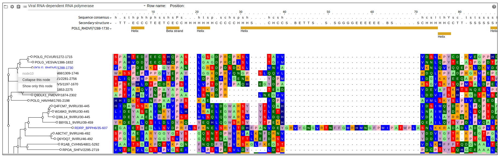

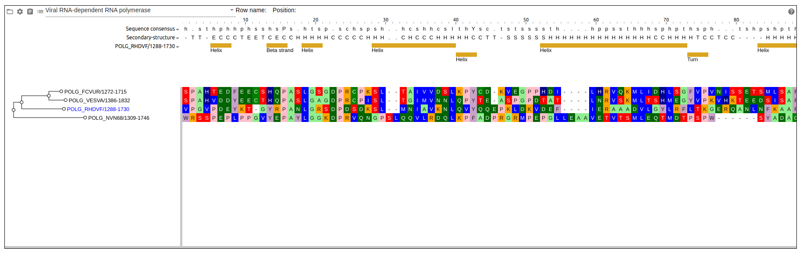

Example showing that the large gappy-ness is collapsed when we "show only
subtree". Gappy-ness can also be removed if you use the "collapse subtree"
function if that subtree introduced gaps.

### Track metadata

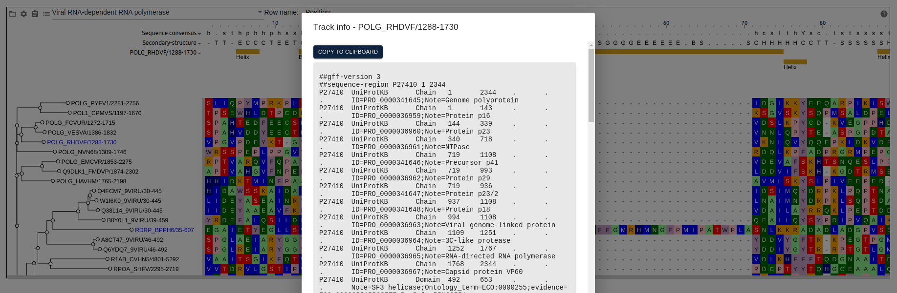

Example of viewing the "track information" for the GFF3 protein domain track

### MSA metadata

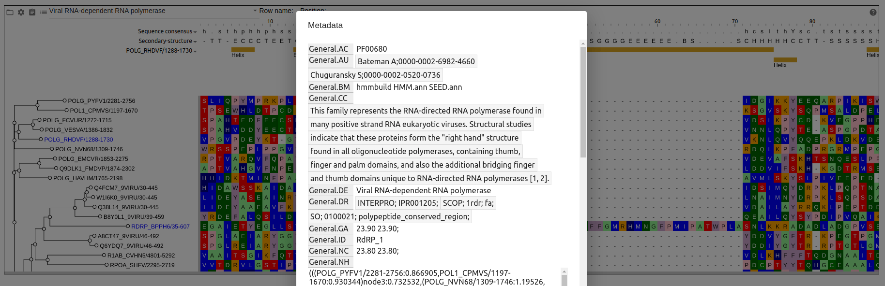

Figure showing metadata stored in the stockholm track header

### Mouse hover

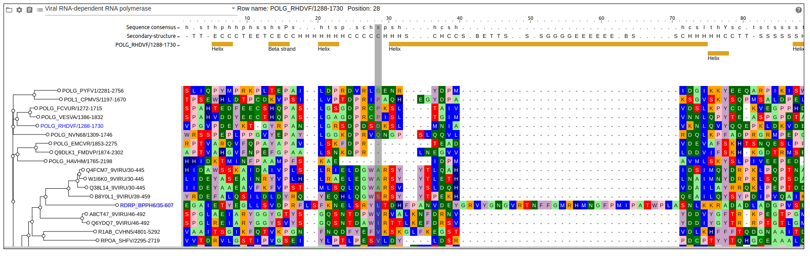

Example of hovering over a particular position, it has the particular row and
column shown in the header in text form, and the column that is hovered over is
shaded.

### Tracklist with MSA annotation tracks

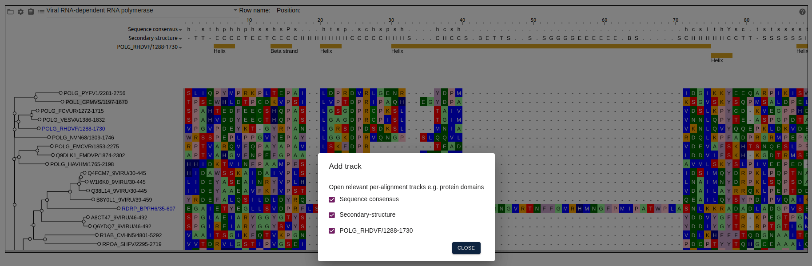

Figure showing "tracklist" showing three annotation tracks. Sequence consensus
and secondary-structure are actually "annotation tracks" that are data that is
from the stockholm file itself, and the orange boxes are protein domains
dynamically fetched from UniProt

### Conserved bases from clustal plotted as track

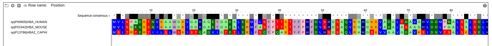

A figure of a CLUSTAL file showing the "conserved" based marked in the file as
an "annotation track". The bases colored black are poorly conserved and white
are best conserved. Normally this data is just in text format, but by loading it
into our viewer, we can add helpful colorings.

### Secondary structure from RNA base pairing Stockholm file

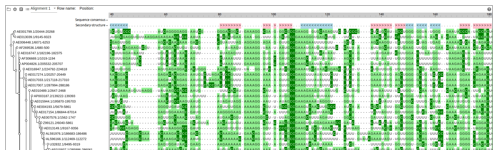

Figure showing multiple sequence alignment of Lysine RNAs from a stockholm file,
with secondary structure annotation line colored by directionality

### Annotations from UniProt for specific row

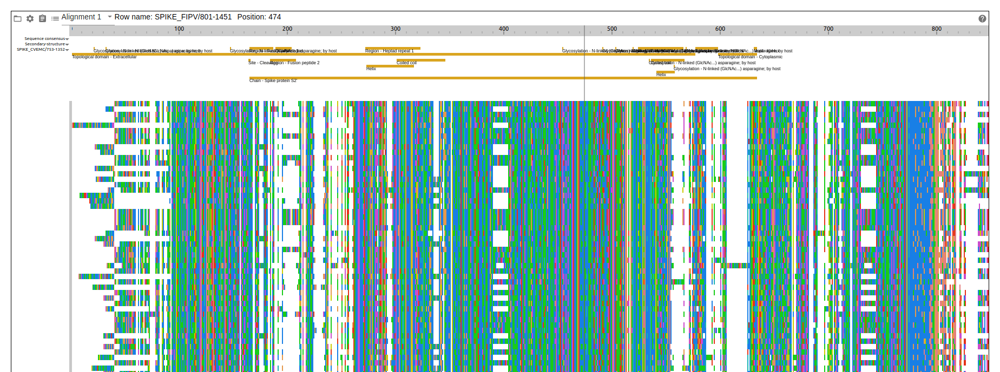

Figure showing the SARS-CoV2 spike protein subunit S2 with "zoomed out" view,
e.g. smaller column width and row height. Annotations are pulled from UniProt
dynamically via a GFF file for SPIKE_CVEMC/753-1352 (MERS-CoV) from
[https://www.uniprot.org/uniprot/K9N5Q8.1.gff](https://www.uniprot.org/uniprot/K9N5Q8.1.gff)
and translated into MSA coordinate space

### Settings panel

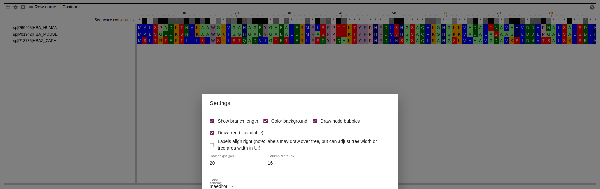

Figure showing the "settings panel", showing color scheme editor and other
settings

### Multi-stockholm file support

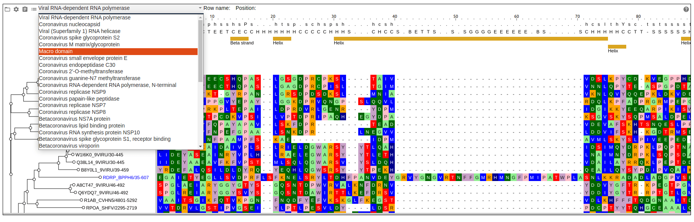

Figure showing a dropdown box demonstrating that we can support
"multi-stockholm" files (a stockholm file that contains multiple MSAs a single
stockholm file can supply multiple MSAs)

### Launching 3-D structure viewer

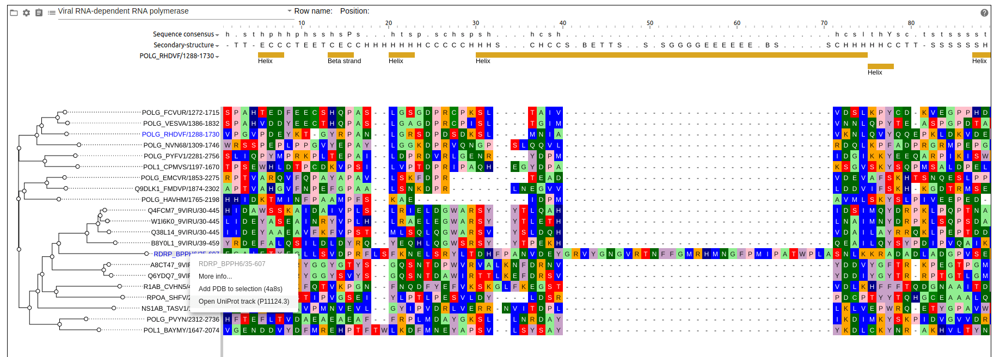

Figure showing that when we click on a given node in the tree, if the
information is available about what protein the node is associated with, then we
can launch a protein viewer, with mouseover highlighting over the MSA being
linked to a tooltip on the 3D structure panel. Also shows the labels in the MSA
using the aligned-right setting.

### Customizing the 3-D structure view

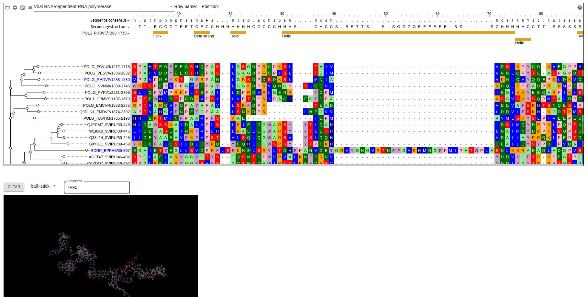

Figure showing that the protein viewer can modify display parameters e.g. change
to ball and stick model, and select only a specific range of bases to display
(0-90)

### Create annotation workflow

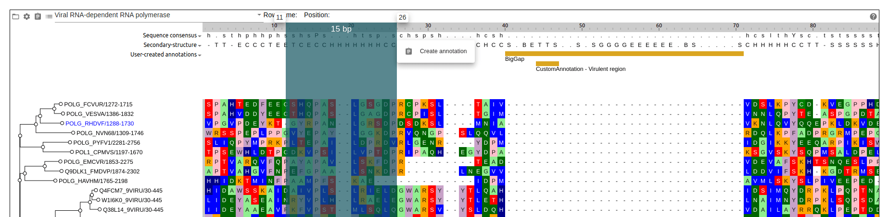

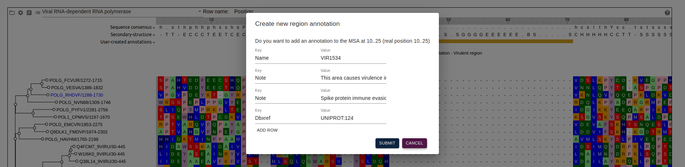

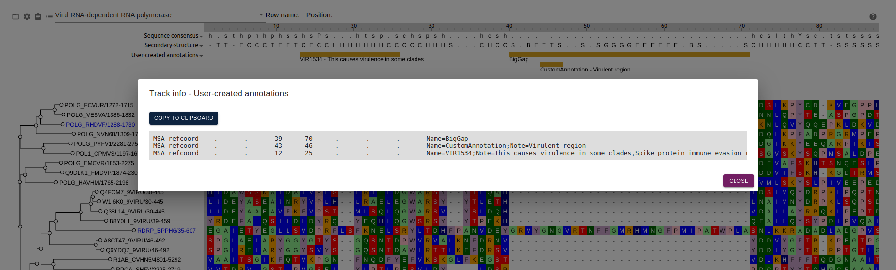

Figure showing a workflow with click-and-drag over a region (1) to highlight and
"Create annotation", which has a dialog (2) that allows editing multiple
attributes which can be stored in column 9 of an exported GFF (3)

### Dynamic color schemes

The clustal_protein_dynamic and percent_identity_dynamic color schemes use
statistics about letters in a certain column to generate a color

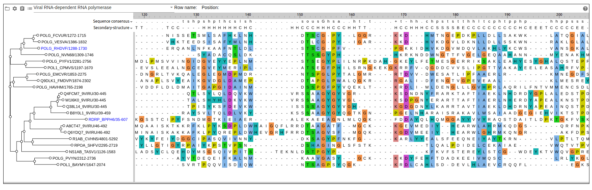

ClustalX dynamic coloring

Percent identity dynamic coloring
